#  QuantImport  
  

**[Home](https://quantimportbrazil.github.io/Sobre/)** | **[Voltar para Demos](https://quantimportbrazil.github.io/Demo/)**  
---  

## Índice da Página

1. [Análise ao longo do ano](#análise-ao-longo-do-ano)  
2. [Análise mês a mês](#análise-mês-a-mês)  

---

## Análise ao longo do ano  
  

* O tamanho da marca "x verde" é proporcional à probabilidade da instância ocorrer.  
* Os testes foram realizados sobre o histórico disponível, podendo alcançar até 15 anos de dados, conforme a série considerada.  

---

## Análise mês a mês

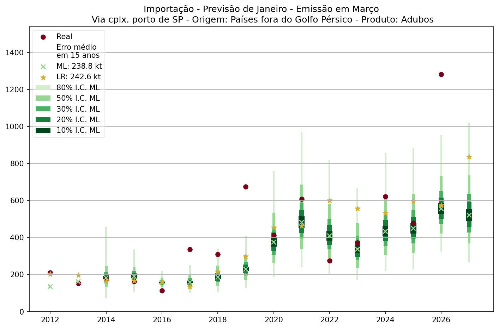
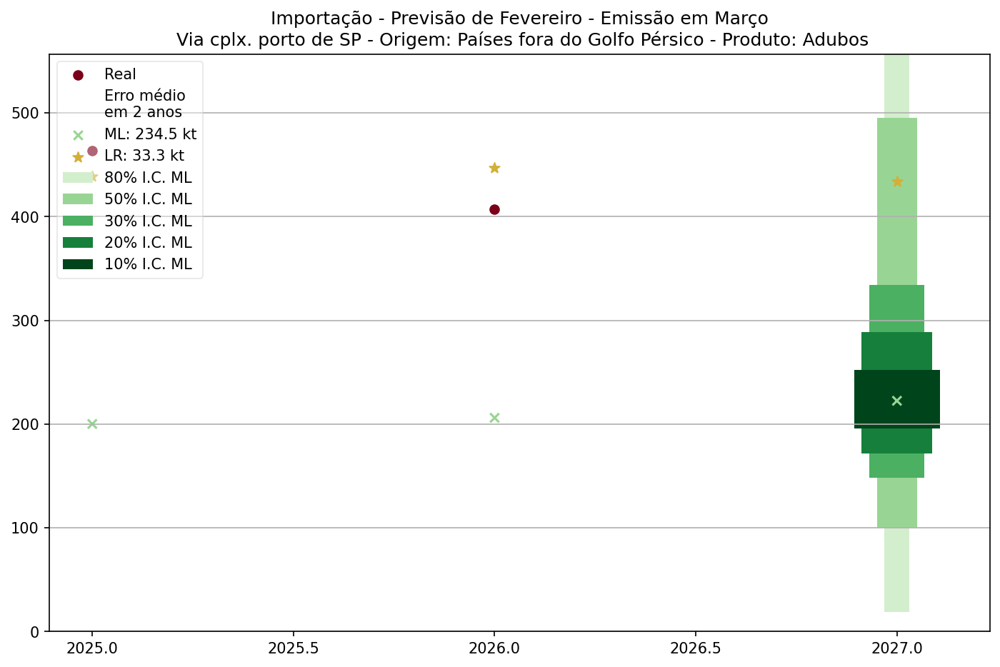
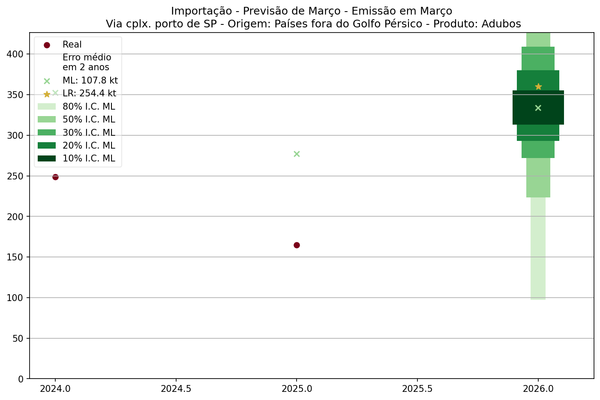
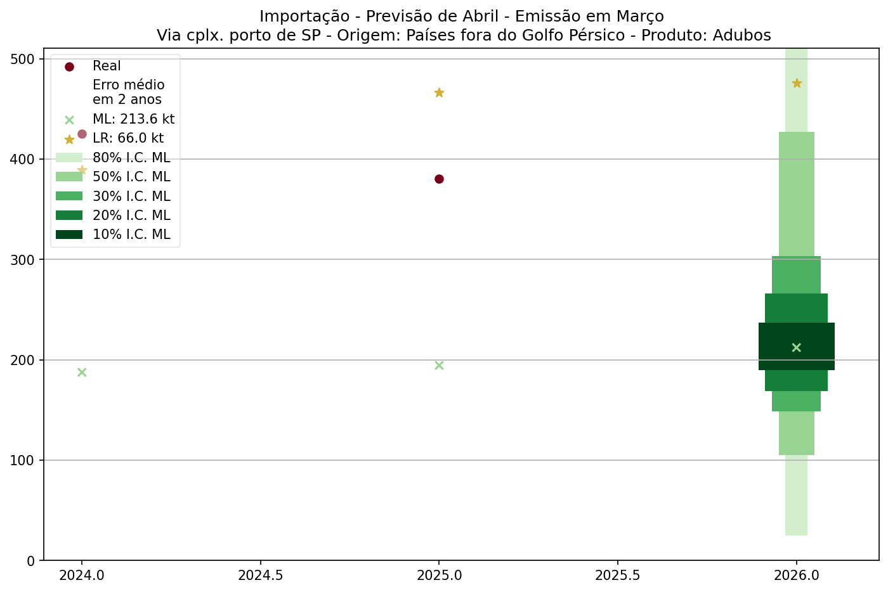
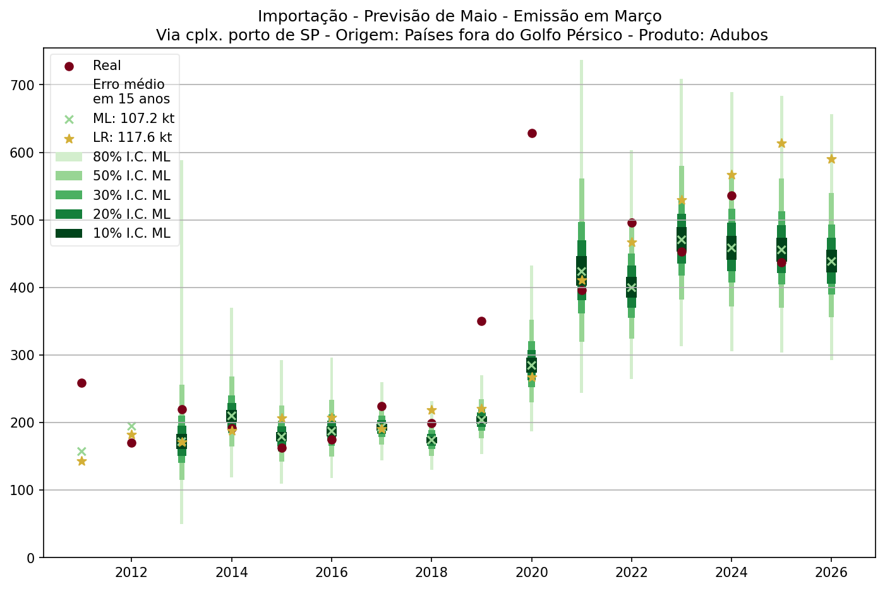
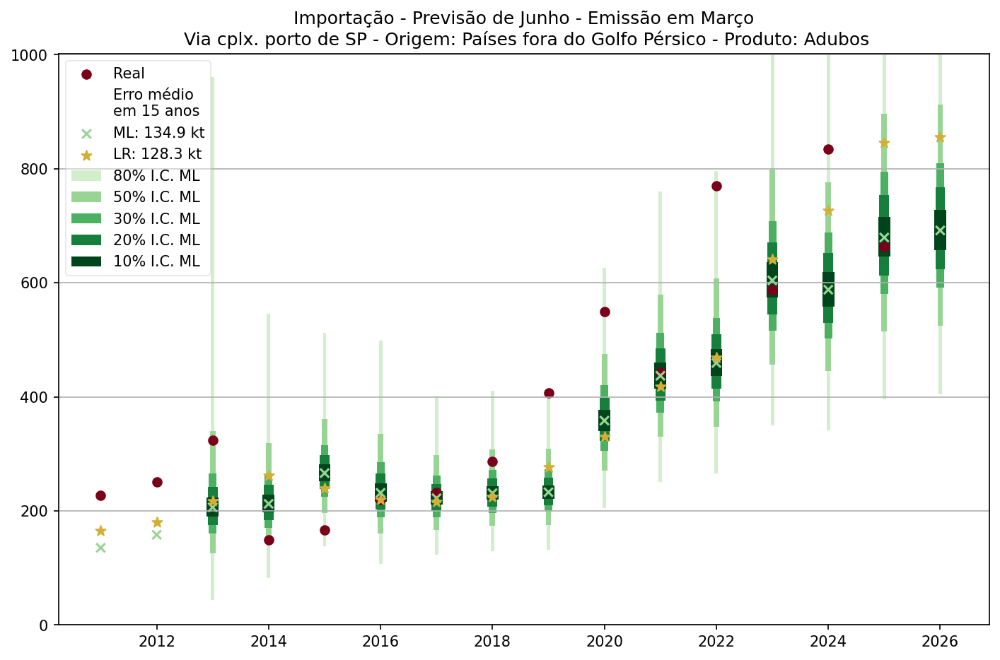
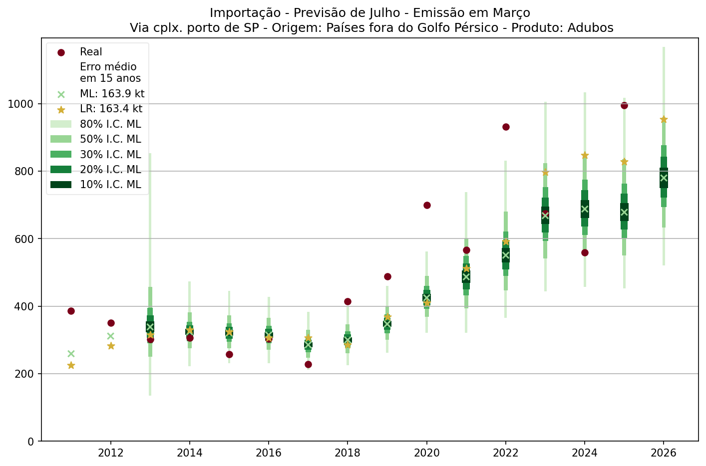

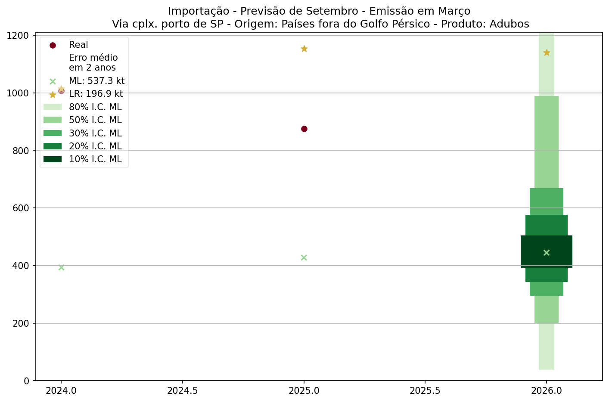
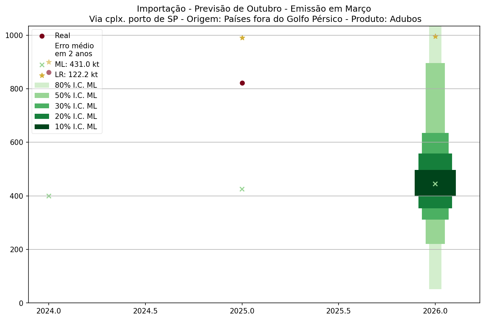
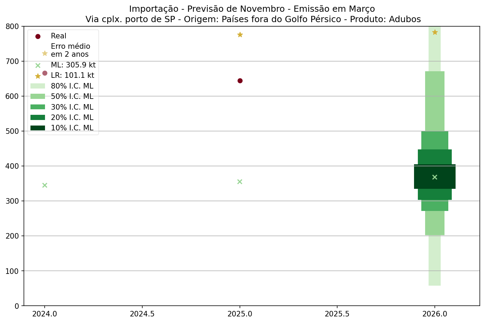
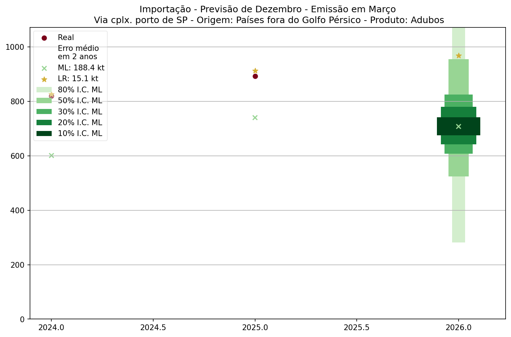

---  

*Modelos utilizados: Machine Learning e Regressão Linear.*
