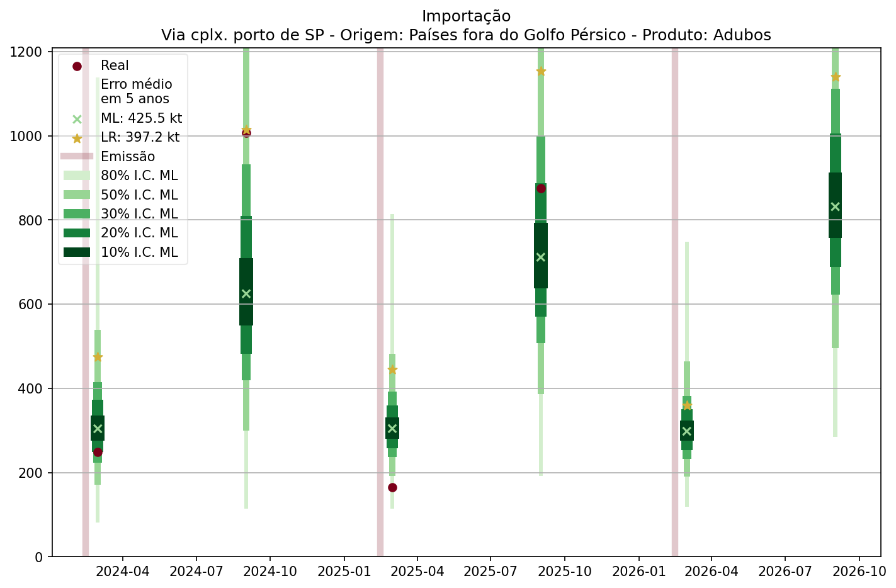

#  QuantImport

**[Home](https://quantimportbrazil.github.io/Sobre/)** | **[Voltar para Demos](https://quantimportbrazil.github.io/Demo/)**

---

> **Emissão:** 2-2026  

---

## Índice da Página

1. [Análise ao longo do ano](#análise-ao-longo-do-ano)  
2. [Análise mês a mês](#análise-mês-a-mês)  
3. [⚠ Principais fatores explicativos (ML)](#principais-fatores-ml)  

---

> ⚠ **Importante:**  
> Ao final desta página encontra-se tabela com a **variável que mais influenciou cada previsão mensal segundo o modelo de Machine Learning**.  

---

## Análise ao longo do ano  
  

## Análise mês a mês

--- 

*Modelos utilizados: Machine Learning e Regressão Linear.*
